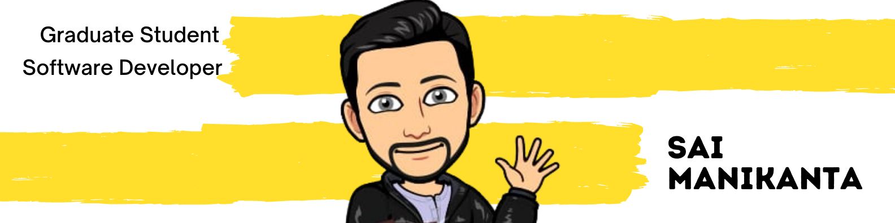

### Hi there 👋

I'm Sai Manikanta 
- <i>Currently:</i> Incoming MS CS Student at The University of Chicago. 
- <i>Previously:</i> Full Stack Software Developer at J.P.Morgan Chase & Co.

<h2>👀 Stats</h2>

  

    <b><em>Overall GitHub Stats:</em></b>  
       
  

<h2>📫 How to reach me:</h2>

 
<!--
**Manikanta2498/Manikanta2498** is a ✨ _special_ ✨ repository because its `README.md` (this file) appears on your GitHub profile.

Here are some ideas to get you started:

- 🔭 I’m currently working on ...
- 🌱 I’m currently learning ...
- 👯 I’m looking to collaborate on ...
- 🤔 I’m looking for help with ...
- 💬 Ask me about ...
- 📫 How to reach me: ...
- 😄 Pronouns: ...
- ⚡ Fun fact: ...
-->
